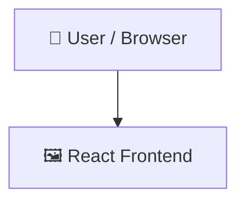

# AutFlow

   

## 📑 Table of Contents

- [Description](#description)
- [Screenshots](#screenshots)
- [Tech Stack](#tech-stack)
- [Architecture](#architecture)
- [Quick Start](#quick-start)
- [Key Dependencies](#key-dependencies)
- [Available Scripts](#available-scripts)
- [Project Structure](#project-structure)
- [Development Setup](#development-setup)
- [Contributors](#contributors)
- [Contributing](#contributing)

## 📝 Description

AuthFlow – A full-stack authentication system built with Spring Boot and React, featuring JWT-based authentication, role-based access control, and secure API integration.

## 📸 Screenshots


## 🛠️ Tech Stack

-ED8B00?style=for-the-badge&logo=openjdk&logoColor=white)    

## 🏗️ Architecture

A high-level view of how the main pieces fit together:



## ⚡ Quick Start

```bash

# 1. Clone the repository
git clone https://github.com/Hardik585/AutFlow.git

# 2. Install dependencies
npm install

# 3. Start the dev server
npm run dev
```

## 📦 Key Dependencies

```
@tailwindcss/vite: ^4.1.18
axios: ^1.13.2
lucide-react: ^0.563.0
react: ^19.2.0
react-dom: ^19.2.0
react-router-dom: ^7.13.0
react-toastify: ^11.0.5
tailwindcss: ^4.1.18
spring-context-support: managed
jakarta.xml.bind-api: managed
jjwt-api: managed
jjwt-impl: managed
jjwt-jackson: managed
spring-boot-starter-mail: managed
spring-boot-starter-security: managed
```

## 🚀 Available Scripts

- **dev** — `npm run dev`
- **build** — `npm run build`
- **lint** — `npm run lint`
- **preview** — `npm run preview`

## 📁 Project Structure

```
.
├── backend
│   ├── dockerfile
│   ├── pom.xml
│   └── src
│       └── main
│           ├── java
│           │   └── com
│           │       └── ...
│           └── resources
│               ├── META-INF
│               │   └── ...
│               └── application.properties
└── frontend
    ├── eslint.config.js
    ├── index.html
    ├── package.json
    ├── src
    │   ├── App.css
    │   ├── App.jsx
    │   ├── assets
    │   │   ├── Header.jpg
    │   │   ├── assets.js
    │   │   ├── logo-flip.png
    │   │   ├── logo.png
    │   │   ├── logohome.png
    │   │   ├── logohome2.jpg
    │   │   └── logohome3.jpg
    │   ├── components
    │   │   ├── Header.component.jsx
    │   │   └── Menubar.component.jsx
    │   ├── context
    │   │   └── Appcontext.jsx
    │   ├── index.css
    │   ├── main.jsx
    │   ├── pages
    │   │   ├── EmailVerify.jsx
    │   │   ├── Home.jsx
    │   │   ├── Login.jsx
    │   │   └── ResetPassword.jsx
    │   └── utils
    │       └── constants.js
    └── vite.config.js
```

## 🛠️ Development Setup

### Node.js / JavaScript
1. Install Node.js (v18+ recommended)
2. Install dependencies: `npm install` (or `yarn` / `pnpm install` / `bun install`)
3. Start the dev server: see the **Quick Start** above

## 👥 Contributors

Thanks to everyone who has contributed to this project:

<p align="left">
<a href="https://github.com/Hardik585" title="Hardik585"></a>
</p>

[See the full list of contributors →](https://github.com/Hardik585/AutFlow/graphs/contributors)
